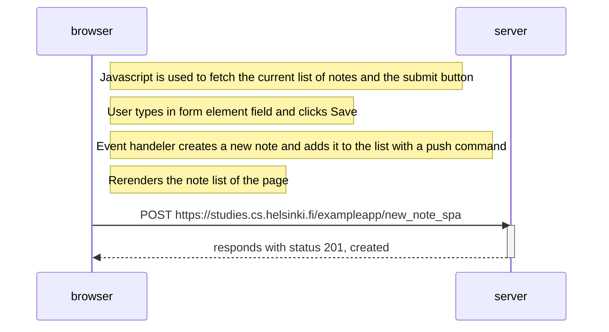

```mermaid
sequenceDiagram
    participant browser
    participant server
    Note right of browser: Javascript is used to fetch the current list of notes and the submit button
    Note right of browser: User types in form element field and clicks Save
    Note right of browser: Event handeler creates a new note and adds it to the list with a push command
    Note right of browser: Rerenders the note list of the page
    browser->>server: POST https://studies.cs.helsinki.fi/exampleapp/new_note_spa
    activate server
    server-->>browser: responds with status 201, created
    deactivate server
```
